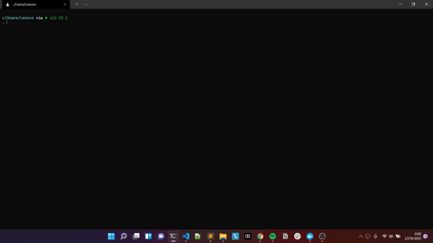

# TODO-CLI

This application was made to improve productivity. This app is really simple to use and fits people who love to work 
with the terminal.

## Installation - Linux
- Clone the repository into your local machine.
- To install this CLI, you can use the `install.sh` file.
    ```sh
    $ chmod +x install.sh
    $ ./install.sh
    ```
- After above command, there will be binary file with name `todo-cli` created under `./src/dist`.
- Add the full path of `./src/dist` to your `$PATH`. For example you can change `$PATH` in your `.zshrc` file (if you use `zsh` terminal) and add the following lines
    ```sh
    # TODO CLI
    export TODO_CLI=your-path/todo-cli/src/dist # NOTE: Change `your-path` with yours
    export PATH=$PATH:$TODO_CLI
    ```
- Start using the `TODO-CLI` in your terminal by typing `todo-cli`. Have fun and stay productive!

## Features

- Add a todo task.
- See the top 5 tasks that should be done on that day. The task is sorted based on the ascending `start_date`,  descending `urgency`, and descending `importance` consecutively.
- See the detail of the task by it's `id`.
- Do the task, i.e. change the `status` of the task become `IN PROGRESS`.
- Mark a task as done i.e. change the `status` of the task become `DONE`.
- Update detail of a certain task.

## DEMO
